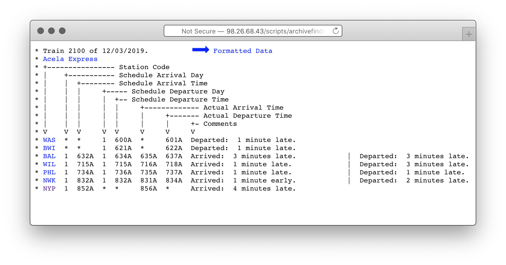

> Update: This work was extended into a [stand-alone website](https://amtrak-on-time.jonathanhunsucker.com) containing all trains' arrival time probability distributions.

Over the last 13 years, John G. Bobinyec has been gathering individual train status information, recording it, and sharing it with the world at [dixielandsoftware.net/Amtrak/status/StatusPages/](http://dixielandsoftware.net/Amtrak/status/StatusPages/). They maintain up-to-date timetables of trains past arrived and currently en route, along with faux [Solari departure boards](https://en.wikipedia.org/wiki/Split-flap_display).



Numbered zip files are tucked away in the corner. To better understand Amtrak's reported [On-time Performance](https://www.bts.gov/content/amtrak-time-performance-trends-and-hours-delay-cause), I dug into a single train's record for 2018. The subject is train 2100, the 6:00A departure from Washington, DC bound for New York Penn Station to arrive at 8:52A. It arrived 4 minutes late on December 3rd, 2019 (picture above).

A cursory analysis cobbled together with `grep`, `awk`, and dash of `php` went like so (units in minutes):

```
~/amtrak-on-time $ curl http://98.26.68.43/AmtrakZips/2018.zip data/2018.zip
~/amtrak-on-time $ unzip data/2018.zip data/
~/amtrak-on-time $ unzip data/2018/2100.zip data/2018/
~/amtrak-on-time $ grep NYP ./data/2018/2100/* | awk '{ print $7 }' | php src/toDelay.php | head -n 5
9
11
15
35
45
```

Looks like the first few days of 2018 were rough for this train. The high level stats for the whole year? A much stronger record.

<table>
  <thead>
    <tr>
      <th>Stat</th>
      <th>Value</th>
    <tr>
  </thead>
  <tbody>
    <tr>
      <td>Median</td>
      <td>4 minutes</td>
    </tr>
    <tr>
      <td>P(less than 10m late)</td>
      <td>77%</td>
    </tr>
    <tr>
      <td>P(less than 30m late)</td>
      <td>95%</td>
    </tr>
  </tbody>
</table>

If you're comfortable being late about once a month, you can plan with confidence on actually arriving by 9:22A.

This was slapdash work, and a number of possible factors could confound it, including:

* Missing data
* Imprecise math
* Inaccurate reporting from Amtrak
* Bug in `toDelay.php`

The next logical step is to address some potential confounders, extend the analysis over multiple years (possibly analyzing within-year trends if possible), and to re-package the analysis so anyone can find their favorite train's performance. In that diretion, `toDelay.php` and the other glue can be found at [github.com/jonathanhunsucker/amtrak-on-time](https://github.com/jonathanhunsucker/amtrak-on-time).
