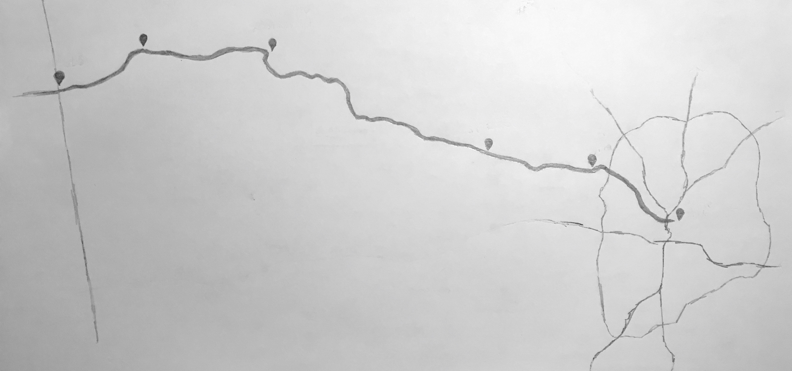

Saturday morning, I woke up to see the bicycle in the living room, prepped. The previous night's packing list was short: repair kit, hammock and tarp, sleeping bag liner, spare shirt, rain coat, towel and soap, phone charger, spare battery, camera. The gear totaled 15lbs. I was ready to go.

### Route

The route was 73 miles in total, east to west:

* Atlanta, mile -12
* Symrna, mile 0
* Powder Springs, mile 12
* Cedartown, mile 35
* Rockmart, mile 51
* Esom Hill trailhead, mile 61

### Preparation

#### Time allocation
Before diving in head first, I ran a few trial rides: Dunwoody to Atlanta (twice), a 50 mile loop Atlanta to Decatur to Stone Mountain and back. Pace from these trials was around 12 miles per hour. I took this and projected at least 12 on-bike hours for the full route. Originally, the plan was to finish in three 50-mile days, spending the twelvish daylight hours in four one-hour sprints with two-hours breaks between. This seemed like a reasonable rate.

#### Packing
The trial rides were un-weighted. It was a variable I'd have to guess on. In terms of securing the load, my existing tools were:

* one square foot elastic net
* 15L and 5L dry bags 
* fanny pack

In the dry bags went the camping gear, toiletries and electronics (sans camera, which went in the fanny pack). The weather was in my favor for packing. With nighttime lows of 68ºs, a liner and spare clothes would suffice to keep me warm. Had it been any cooler, I would have needed to pack heavier and larger.

### En route
After a heavy breakfast Saturday morning, the trip began around noon. On time, I was mile 0, Mavell Road trailhead, by 1pm. 

The hill near Grady Road is an unpleasant surprise. The sections before and after, are graded like the rail lines they replaced. But near Grady Road, the trail kicks up off the old railroad and hugs along an active rail segment's side, following the rolling hills of the Piedmont region that had been driven flat in the earlier part of my ride.

### Camp

A half mile off the trail, just before Cedartown, was Saturday night's accomodations at Beautiful Rock campground. 

On account of packing lightly, camp was simple — a hammock and rain fly. The sun late Saturday evening made a convenient photo opportunity. At this point, temperatures were still hanging in the low 80s. The kind of temperature were you sweat standing still. 

### Sunday morning departure

The sun woke me up around 7:30am. The air was a crisp 72º. It was a welcome relief. 

### Esom Hill trailhead

Around noon Sunday, I arrived at the Georgia–Alabama border, the half-way point for my trip. There's a mailbox containing a notebook, signed by visitors. Notes ranged from one-liners to paragraphs. A few notes were memorable. One written by a couple whose trip was as long as their anniversary that day was, in miles. The others being more folks with the wild idea of traveling round-trip from Atlanta (it was nice to know other's had succeeded). 

At this point, I calculated I could get home by 7pm, if I kept up the previous day's pace. 
I maintained an average speed around 7mph (including breaks), but it was more tiresome than I had imagined it would be. My vigor began waning around the mid-20s mile marker (mile 60 or so for the day).

Getting back to Symrna around 6:30pm, a storm was brewing to the south. I grabbed a late lunch, and got back at it. From mile 0 into town, the straightest route is along Atlanta Road, a four to six-lane highway. There are no bike lanes, and cars' speeds are in excess of 50 mph. This final approach was a stark contrast to the trail's calm and tranquility. Nearing the Northfold Southern Inman train yard, I noticed the storm getting stronger, kicking up winds. It became a race for me.

Pure exhaustion fueled the last five miles. Pure relief and accomplishment washed me over once I was back at my apartment. Nearly 150 miles behind me, the sun already set, I had done the thing I had set out to do, and I couldn't have been happier with myself for it. 
