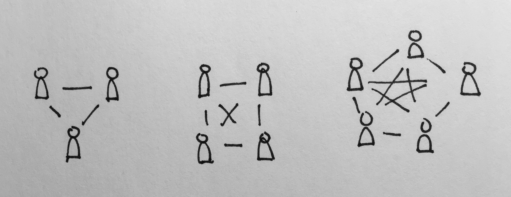

The birthday problem is as follows:

> How many people must be in the same room to make it likely that somebody shares a birthday?[^question]

[^question]: Likely means "better than a coin flip", or `P >= 1/2`. The formulation of this question is tricky. We can't say "likely that two people share a birthday", because that's overly restrictive: it's okay if three people share a birthday.

We'll capture this problem as `Pb(n) = P(two or more people in room with n-many people, share a birthday)`.

### First step

Out the gate, let's take the complement of `Pb(n)`:

> `Pb(n) = 1 - P(no people share a birthday) = 1 - Pnb(n)`

Although `Pb(n)` appears innocuous, a direct calculation presents a tall hurdle. With either, there'll be some component representing the available birthdays, whose denominator initially containing 365. With `Pb(n)` though, as the population grows, the available pool of birthdays dwindles. This property will make directly finding an equation more difficult. Instead, we can side-step this hurdle, by working towards a `Pnb(n)` equation.

### Small `n`
As an exercise in discovery, let's calculate the odds for small numbers of people:

`Pnb(1) = 0`

`Pnb(2) = odds that second person's birthday is different from first`  
`= 364/365`

`Pnb(3) = odds that neither persons A and B, nor A and C, nor B and C share birthday`  
`= 364/365 * 364/365 * 364/365`  
`= (364/365)^3`

`Pnb(4) = odds that none of these pairs of people share a birthday`:

- A and B
- A and C
- A and D
- B and C
- B and D
- C and D

`= (364/365)^6`

Quickly, we see that calculating the probability will depend on counting the number of pairs of people in the room. Let's reframe `Pnb(n)`:

> `Pnb(n) = odds that none of the pairs of people share a birthday`  
> `= 364/365^(number of pairs of people)`

### Counting pairs of people
This presents a sub-problem that we can tackle in isolation, and recombine afterwards:

> Given `n` people, how many distinct pairs are there? 

Drawing three people, with a line between each pair of people, we find there are thee pairs. With four people, there's six pairs. Five people, ten pairs.

This is very similar to counting from [1 to `n`](/posts/sum-from-one-to-n), except that `n` in this problem, is one greater the input to that problem's equation. Here's an adjusted formula for this problem:

> `Number of pairs = 1/2*(n-1)*n`

| People | Pairs | `1/2*(n-1)*n` |
|---|---|---|
|1|0|`1/2*(1-1)*1 = 0` ✓|
|2|1|`1/2*(2-1)*2 = 1` ✓|
|3|3|`1/2*(3-1)*3 = 3` ✓|
|4|6|`1/2*(4-1)*4 = 6` ✓|
|5|10|`1/2*(5-1)*5 = 10` ✓|

### Circling back
Going back to the calculating `Pnb(n)`, we can replace "number of pairs of people" with `1/2*(n-1)*n`, giving us:

> `Pnb(n) = (364/365)^(1/2*(n-1)*n)`

Now we have an equation whose only variable is `n`. We'd like to know what value of `n` is sufficient to make `Pb(n) >= 1/2`. Rephrasing:

> `Pb(n) >= 1/2`  
> `1 - Pnb(n) >= 1/2`  
> `1 - (364/365)^(1/2*(n-1)*n) >= 1/2`  
> `1 - 1/2 >= (364/365)^(1/2*(n-1)*n)`  
> `1/2 >= (364/365)^(1/2*(n-1)*n)`

At this point, there at least two paths to proceed along:

1. Use algebra to find a simple equation, solving for `n`
1. Guess and check to find the smallest value of `n` satisfying the inequality

Considering the first path, the equation would involve logarithm (due to the exponentiation), and the [quadratic equation](/posts/eleven-formulations-quadratic-equation) (due to the `n^2` term). Together, that sounds more involved than guessing and checking.

I'll take `182` as my first guess, since it's half of `365` [^182].

[^182]: This is a common guess. We're familiar with the number of days in a year, and we need some odds greater than `1/2`, so it makes sense to try half of 365. The sole input to `Pnb(n)`, aka `n`, is in units "people", so chosing a value related to days in a year is off base.

> `(364/365)^(1/2*(n-1)*n) = (364/365)^(1/2*(182-1)*182) ~= 0.00000000000000000002372`

This is far smaller than `1/2`, so we're not close yet. Looking at the equation, we can find what direction to go: if I increase my guess, then the power of `364/365` increases, which will make the value smaller. We need a higher value, to begin approaching `1/2`, so we need a smaller guess. I'll try `30`.

> `(364/365)^(1/2*(n-1)*n) = (364/365)^(1/2*(30-1)*30) ~= 0.3032`

Much closer to `1/2`. Let's build a table with our guesses, cataloging the search:

|People|Odds|Verdict|
|---|---|---|
|`182`|`(364/365)^(1/2*182*(182-1)) ~= 0.00000000000000000002372`|Way too large a guess|
|`30`|`(364/365)^(1/2*30*(30-1)) ~= 0.3032`|Closer|
|`15`|`(364/365)^(1/2*15*(15-1)) ~= 0.7497`|Overshot `1/2`|
|`22`|`(364/365)^(1/2*22*(22-1)) ~= 0.5306`|Just slightly over|
|`23`|`(364/365)^(1/2*23*(23-1)) ~= 0.4995`|Precisely enough people|

This is surprising! We need only 23 people in the room, to make it likely that someone will share a birthday.

### Closing thoughts
Why is this such a small number? Let's reflect on the equation: `364/365^(1/2*(n-1)*n)`. `364/365` is marginally less than one, and continues to get shrink as the exponent's power grows. The power is `1/2*(n-1)*n = 1/2*(n^2 - n)`. In particular, `n^2` grows much quicker than `n`. Imagine the area of a square, and how quickly its area grows as both its sides, `n`, increase. We need only 23 people, far less than 182, because number of pairs of people grows this quickly.
