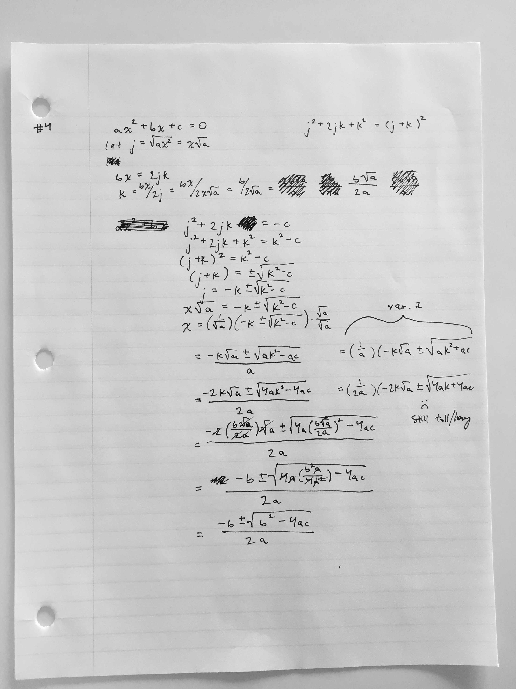
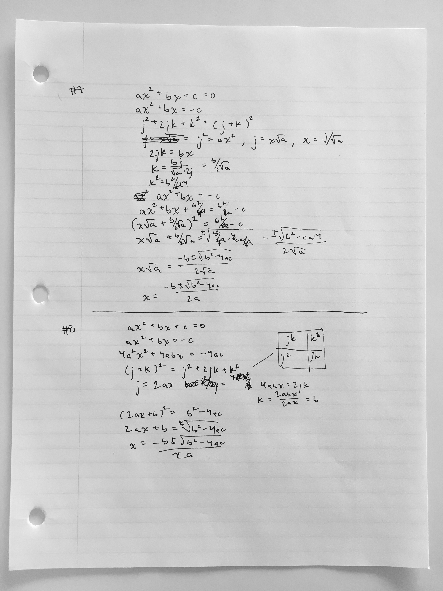

### Aim
My aim was to find a short and simply formulation of the Quadratic Formula. I made multiple attempts at formulation throughout a day, and catalogued the changes made between them.

### Learnings
Coming up with tidy formulations is a progression. There's multiple paths, all with the same outcome (the quadratic formula), but with different amounts of clarity, self-explanation, and follow-along-ability. Later formulations were shorter or involved less algebraic shuffling to settle out, but traded away clarity to achieve it. For example, Formulation #8 has a "scale by `4a`" step. This creates for less shuffling later on, at the cost of pulling `4a` from thin air.

### Eleven formulations

The first approach failed, having not realized that `c` needs to be isolated in order to simplify getting into the `j^2+2jk+k^2` form. After approaching the problem in reverse, in formulation #2, I realize that multiplying by `4a` will help.

Recognize that "Completing the square" will be useful here, and take `ax^2` as `j^2`, leading to radicals in `j` and `k`, making the middle section heavy, and dedicating the last section towards simplifying the formula.

Leave `j` and `k` in for longer, hoping that the formula will simplify a little before needing to resubstitute them. Doesn't achieve much towards that goal.

Formulation #5 jumps straight into finding substitute values for `j` and `k`. It does achieve a shorter formulation, but at the expensive of a jarring substitution.

Formulation #7 is the last one with radicals in `j` and `k`. Formulation #8 introduces a "scale by `4a`" step early on, letting `j=2ax` and `k=b` — something easier to work with in the middle and late sections, but another "magic" step from left field.

Formulation #9 adds per-step descriptions. Formulation #10 is the shortest so far. Formulation #11 issued an attempt to integrate the visual representation of completing the square, but was abandoned.

### Outstanding questions
* Is there a formulation where "completing the square" springs up naturally, as opposed to being brought in through epiphany or prior knowledge?
* How might people rank these formulations, in terms of their clarity?
* If "completing the square" and "equation manipulation tactics" are prerequisites for "find the quadratic formula", what problems have "find the quadratic formula" as a prerequisite?
