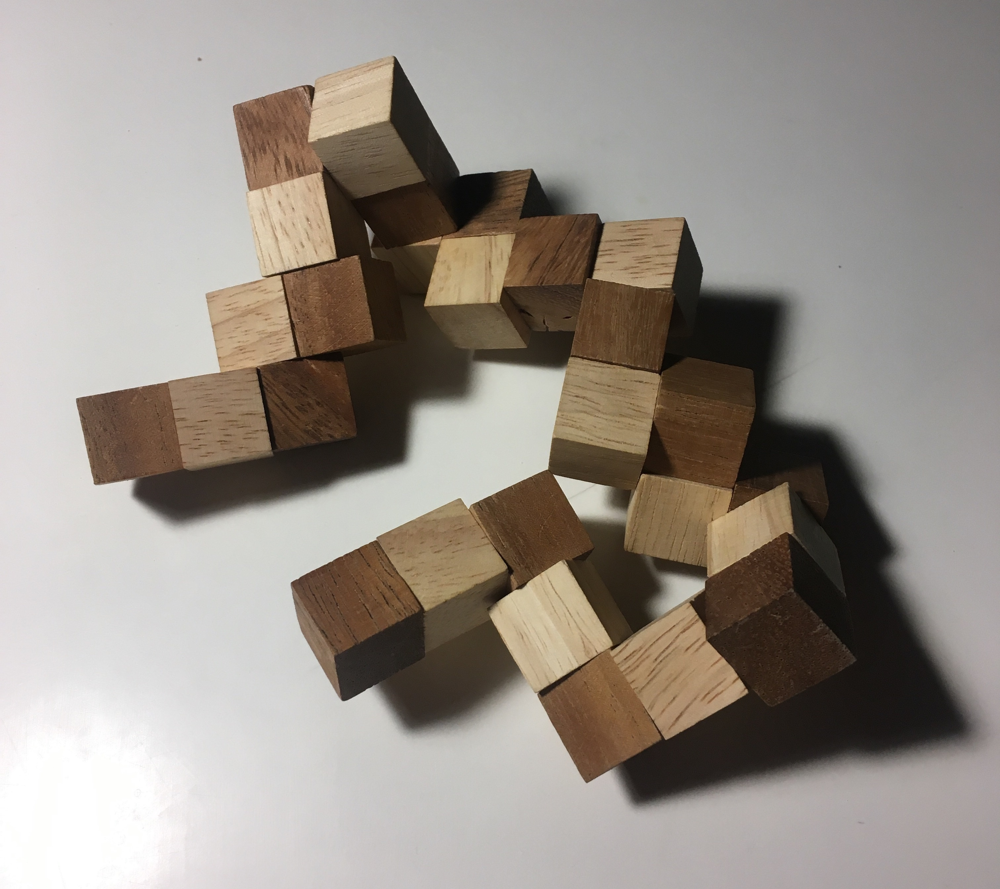
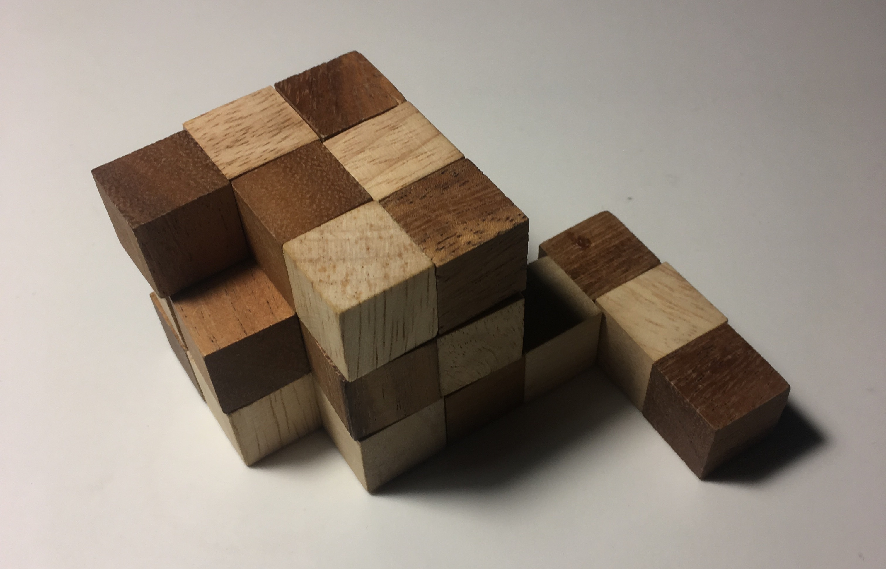
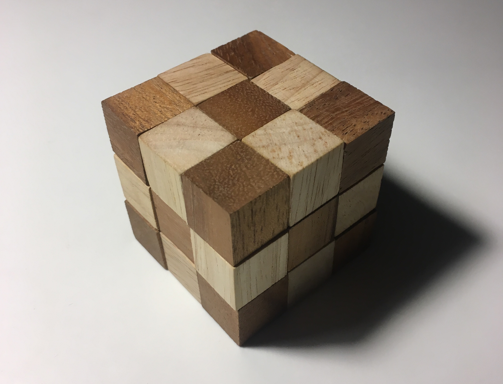

The snake puzzle consists of 27 blocks, held together by an elastic string threaded through holes in each of the blocks. Some blocks have a straight hole connecting one side to the opposite. Some blocks have holes connecting one side to an adjacent side, creating a bend. The challenge of the puzzle, is to orient the blocks so that they form a cube, three blocks tall.



#### Finding an approach
After many hours toying around with it, I began to adopt a simple approach:

1. Fold the puzzle one segment at time (a segment being a run of straight-hole blocks)
1. If a segment causes the solved portion of the puzzle to run outside of a 3x3x3 cube, unfold and try again

After many more hours, I realized that my approach could be codified into a program, to simulate the puzzle and find a solution faster than one could by hand.

#### Finding a suitable notation
The puzzle's configuration can be encoded as a list of segment lengths. For example, the puzzle I have on hand, is encoded like so:
```php
new Puzzle([3, 2, 2, 3, 2, 3, 2, 2, 3, 3, 2, 2, 2, 3, 3, 3, 3]);
```
All together, the list sums to 27, so `Puzzle` determines the goal is three-block-tall cube. 

Many notations exist, though some are easier to work with than others. For example, a list of 27 values, one for each block, would also suffice. So might a 3D model of the puzzle. 

#### Defining the solution
My puzzle had 17 segments. With four possible turns available at every segment connection, there are 16<sup>4</sup> = 65,536 possible arrangements, ignoring that a block can't physically occupy the same space [^regret]. Part of defining the solution is defining what is not the solution. Immediately, a few criteria [^whittling] for non-solutions stand out:

[^regret]: Why didn't I calculate out 16<sup>4</sup> from the beginning? I would have side-stopped the search-based solver had I know that the solution space was relatively small.
[^whittling]: How much of the solution is invalided by each criteria mentioned? Are their space-minimization worth their computational cost-savings? Is it possible, that adding more criteria, counterintuitively, slows the search down, since every candidate must be be checked, but maybe only a few candidates are invalidated?

* Incomplete - Not all segments used, the puzzle has one or more segments unaccounted for
* Overflows - Width, length, or height is greater than three
* Overlaps - Physically not possible, turning back on itself, two blocks in same space



```php
$unstarted_puzzle = new Solution($puzzle, /* turns so far */ []);
```

Every solution has to start somewhere. For the chosen notation, a `Solution` also captures in-progress work. It's tightly coupled to `Cube`, which translates `Solution`'s turn-by-turn instructions into a list of discrete three-dimensional positions the blocks occupy. `Cube` also ensures the solution avoids breaking the overlaps and overflows criteria, via its `isValid()` function. The incomplete criteria is enforced via a separate `Solution->isComplete()` function.

#### Scaffolding a search
With a notation and solution space defined, the search begins. Similar to notations, there's many suitable approaches to [searching](https://en.wikipedia.org/wiki/Category:Search_algorithms). A breadth-first search was employed against this problem. Here's a sample of a search, instrumented such that it spits out each partial solution as it stumbles upon it:

```
$ ./script/bench | head -n 23
[]
["up"]
["right"]
["down"]
["left"]
["forward"]
["backward"]
["up","up"]
["up","right"]
["up","down"]
["up","left"]
["up","forward"]
["up","backward"]
["up","right","up"]
["up","right","right"]
["up","right","down"]
["up","right","left"]
["up","right","forward"]
["up","right","backward"]
["up","right","right","up"]
["up","right","right","right"]
["up","right","right","down"]
["up","right","right","left"]
```

Of these "thought-up" solutions, only those begninning with `"up"`, `"right"`, and `"backward"` continue on to form longer partial solutions, since the others don't meet the Overflow criteria.

#### Finding solutions
After about 13k more lines, the search concludes with these six solutions:

```
Found solution: Solution(up, right, down, backward, right, forward, up, backward, left, down, right, forward, right, backward, left, up, right)
Found solution: Solution(up, backward, down, right, backward, left, up, right, forward, down, backward, left, backward, right, forward, up, backward)
Found solution: Solution(right, up, left, backward, up, forward, right, backward, down, left, up, forward, up, backward, down, right, up)
Found solution: Solution(right, backward, left, up, backward, down, right, up, forward, left, backward, down, backward, up, forward, right, backward)
Found solution: Solution(backward, up, forward, right, up, left, backward, right, down, forward, up, left, up, right, down, backward, up)
Found solution: Solution(backward, right, forward, up, right, down, backward, up, left, forward, right, down, right, up, left, backward, right)
```



#### Towards a deeper understanding
With an automatic solver in hand, the puzzle can be characterized and understood deeper.

First off, the six solutions above are one and the same. For example, take the first formulation, rotate 90º clockwise about the back direction, and 90º clockwise about the left direction clockwise, then you arrive at the fourth formulation. Repeating those rotations once more, arrives at the fifth formulation. The other three formulations are equal, because they're mirrors of existing formulations, across the plane normal to (-1, 1, 0), that is the plane formed by the triangle (0, 0, 0), (3, 3, 0), and (3, 3, 3) [^directions].

[^directions]: Right is positive x axis, back is positive y axis, up is positive z axis. Points are given by (x, y, z).

##### How many solutions for this configuration?
The answer depends on what types of transformations are considered trivial. 

If all transformations are considered non-trivial, then there are six solutions. However, if rotation alone is trivial, then there are three solutions. Further, if all transformations (rotation and reflection) are trivial, then there is one solution.

Together, we can think of solutions as isomorphic, given a set of aspects:

| Transformations considered trivial | Unique solutions |
| --- | --- |
| `[]` | 6 |
| `[rotating]` | 2 |
| `[mirroring]` | 3 |
| `[rotating, mirroring]` | 1 |

##### Is there a different solution representation, which would find rotation-agnostic solutions?

Yes. A turn-based representation would find that three of the above solutions are equivalent. Also, refining the search space to a single starting direction, would also whittle down the list of solutions to just two: one and its mirror. 

##### How many solvable 3-tall configurations?
Same question as "how many traversals of a 3-tall cube exist?". Begs questions:

* Which traversals are consider the "same"? Does this change the quantity?
* Can we grade configurations on their difficulty?
* How many solvable 2-tall configurations? 4-tall?

All code can be found [here](https://github.com/jonathanhunsucker/snake-puzzle).
