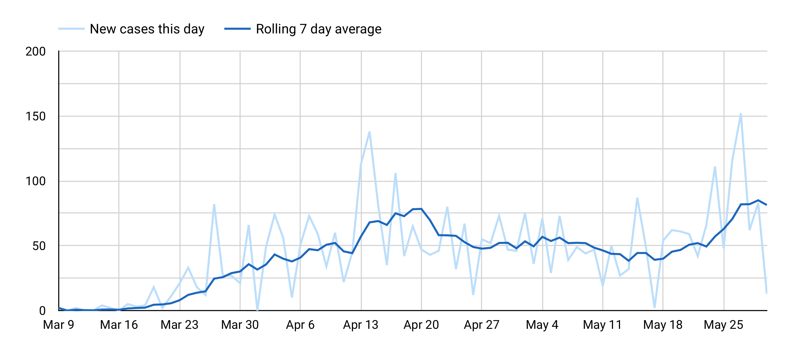

+++
publishDate = 2020-05-31T04:00:00Z
title = "Visualizing COVID-19 new cases daily"

+++

Everyone is reacting COVID-19 in their own way. My own reaction is inconsistent. Some days, I'm alright with going on a run without a mask, and other days, I'd prefer to stay in. The dissonance and stress has drive me to dig into case count figures myself. Building is my coping strategy. It hasn't given me solace, but the flickering sense of autonomy helps. 

One artifact I'd like to share is a graph of the rolling 7 day average of new cases daily. It can be filtered by states and counties. [See the data](https://datastudio.google.com/reporting/1b28584b-0ecc-4f3f-aa50-3ea06a72728a) for a county you care about.
